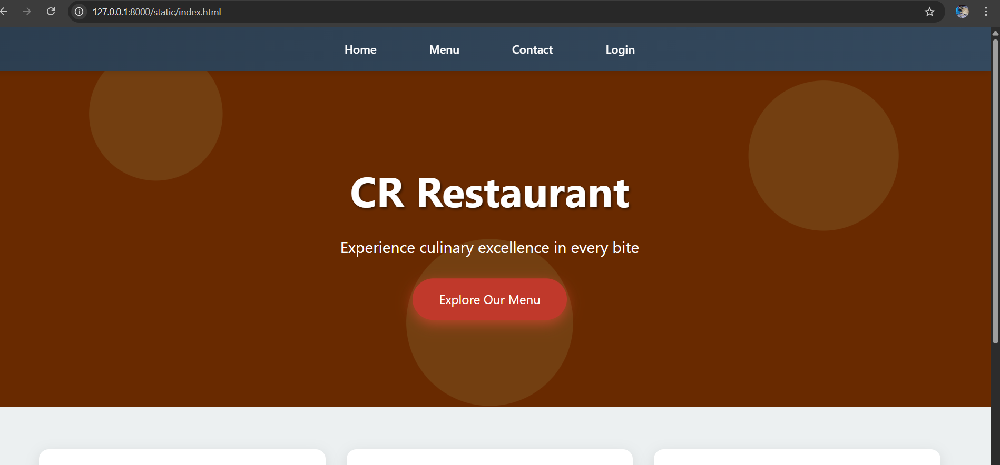
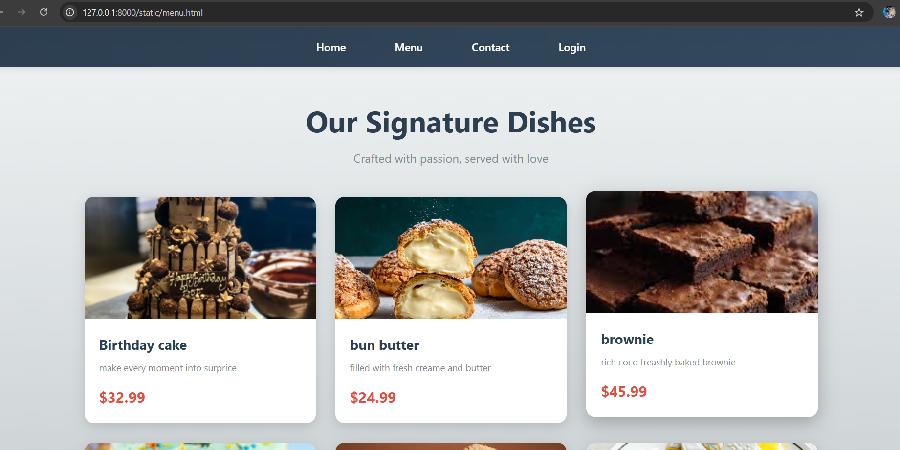
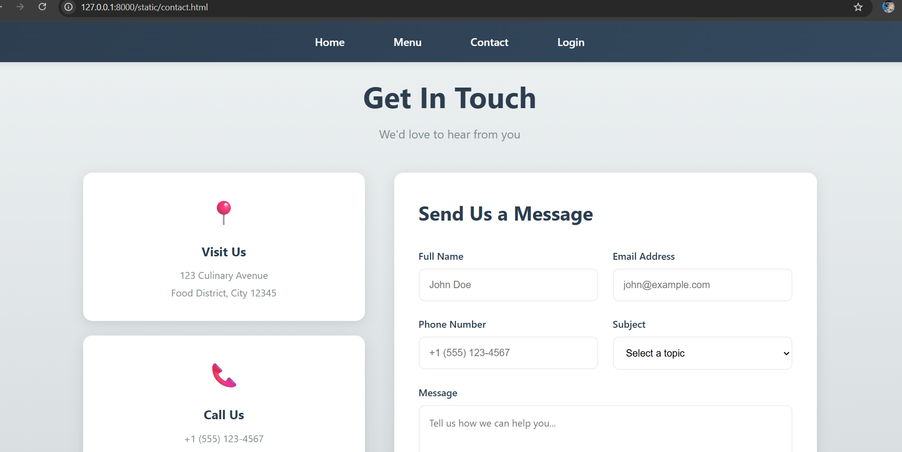
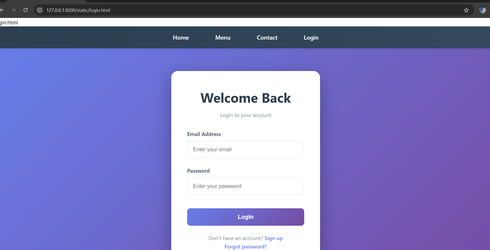

# Ex.06 Restaurant Website
## Date:18.12.2025

## AIM:
To develop a static Restaurant website to display the food items and services provided by them.

## DESIGN STEPS:

### Step 1:
Requirement collection.

### Step 2:
Creating the layout using HTML and CSS.

### Step 3:
Updating the sample content.

### Step 4:
Choose the appropriate style and color scheme.

### Step 5:
Validate the layout in various browsers.

### Step 6:
Validate the HTML code.

### Step 7:
Publish the website in the given URL.

## PROGRAM:
```
index.html
<!DOCTYPE html>
<html lang="en">
<head>
    <meta charset="UTF-8">
    <meta name="viewport" content="width=device-width, initial-scale=1.0">
    <title>CR Restaurant - Home</title>
    <link rel="stylesheet" href="styles.css">
</head>
<body>
    <nav>
        <ul>
            <li><a href="index.html">Home</a></li>
            <li><a href="menu.html">Menu</a></li>
            <li><a href="contacts.html">Contact</a></li>
            <li><a href="login.html">Login</a></li>
        </ul>
    </nav>

    <section class="hero">
        <div class="hero-content">
            <h1>CR Restaurant</h1>
            <p>Experience culinary excellence in every bite</p>
            <a href="menu.html" class="cta-button">Explore Our Menu</a>
        </div>
    </section>

    <section class="features">
        <div class="feature-card">
            <div class="feature-icon">🍽️</div>
            <h3>Fresh Ingredients</h3>
            <p>We source only the finest, locally-grown ingredients to create dishes that burst with authentic flavors and nutrition.</p>
        </div>
        <div class="feature-card">
            <div class="feature-icon">👨‍🍳</div>
            <h3>Expert Chefs</h3>
            <p>Our award-winning culinary team brings decades of experience and passion to every plate they create.</p>
        </div>
        <div class="feature-card">
            <div class="feature-icon">⭐</div>
            <h3>5-Star Service</h3>
            <p>From the moment you arrive until your last bite, our dedicated staff ensures an unforgettable dining experience.</p>
        </div>
    </section>

    <footer>
        <p>&copy; 2025 CR Foods. All rights reserved.</p>
    </footer>
</body>
</html>

login.html
<!DOCTYPE html>
<html lang="en">
<head>
    <meta charset="UTF-8">
    <meta name="viewport" content="width=device-width, initial-scale=1.0">
    <title>Savory Bistro - Login</title>
    <link rel="stylesheet" href="styles.css">
</head>
<body>
    <nav>
        <ul>
            <li><a href="index.html">Home</a></li>
            <li><a href="menu.html">Menu</a></li>
            <li><a href="contact.html">Contact</a></li>
            <li><a href="login.html">Login</a></li>
        </ul>
    </nav>

    <div class="login-page">
        <div class="login-container">
            <div class="login-header">
                <h1>Welcome Back</h1>
                <p>Login to your account</p>
            </div>

            <form onsubmit="handleLogin(event)">
                <div class="form-group">
                    <label for="email">Email Address</label>
                    <input type="email" id="email" placeholder="Enter your email" required>
                </div>

                <div class="form-group">
                    <label for="password">Password</label>
                    <input type="password" id="password" placeholder="Enter your password" required>
                </div>

                <button type="submit" class="login-button">Login</button>

                <div class="login-footer">
                    <p>Don't have an account? <a href="#">Sign up</a></p>
                    <p><a href="#">Forgot password?</a></p>
                </div>
            </form>
        </div>
    </div>

    <script>
        function handleLogin(e) {
            e.preventDefault();
            const email = document.getElementById('email').value;
            alert('Login functionality would be connected to backend. Email: ' + email);
        }
    </script>
</body>
</html>

contact.html
<!DOCTYPE html>
<html lang="en">
<head>
    <meta charset="UTF-8">
    <meta name="viewport" content="width=device-width, initial-scale=1.0">
    <title>Savory Bistro - Contact Us</title>
    <link rel="stylesheet" href="styles.css">
</head>
<body>
    <nav>
        <ul>
            <li><a href="index.html">Home</a></li>
            <li><a href="menu.html">Menu</a></li>
            <li><a href="contact.html">Contact</a></li>
            <li><a href="login.html">Login</a></li>
        </ul>
    </nav>

    <div class="contact-page">
        <div class="contact-header">
            <h1>Get In Touch</h1>
            <p>We'd love to hear from you</p>
        </div>

        <div class="contact-container">
            <div class="contact-info">
                <div class="info-card">
                    <div class="info-icon">📍</div>
                    <h3>Visit Us</h3>
                    <p>123 Culinary Avenue<br>Food District, City 12345</p>
                </div>

                <div class="info-card">
                    <div class="info-icon">📞</div>
                    <h3>Call Us</h3>
                    <p>+1 (555) 123-4567<br>+1 (555) 987-6543</p>
                </div>

                <div class="info-card">
                    <div class="info-icon">✉️</div>
                    <h3>Email Us</h3>
                    <p>info@crfoods.com<br>reservations@crfoods.com</p>
                </div>

                <div class="info-card">
                    <div class="info-icon">🕒</div>
                    <h3>Opening Hours</h3>
                    <p>Mon - Fri: 11:00 AM - 10:00 PM<br>
                    Sat - Sun: 10:00 AM - 11:00 PM</p>
                </div>
            </div>

            <div class="contact-form-container">
                <h2>Send Us a Message</h2>
                <form onsubmit="handleContact(event)" class="contact-form">
                    <div class="form-row">
                        <div class="form-group">
                            <label for="name">Full Name</label>
                            <input type="text" id="name" placeholder="John Doe" required>
                        </div>

                        <div class="form-group">
                            <label for="email">Email Address</label>
                            <input type="email" id="email" placeholder="john@example.com" required>
                        </div>
                    </div>

                    <div class="form-row">
                        <div class="form-group">
                            <label for="phone">Phone Number</label>
                            <input type="tel" id="phone" placeholder="+1 (555) 123-4567">
                        </div>

                        <div class="form-group">
                            <label for="subject">Subject</label>
                            <select id="subject" required>
                                <option value="">Select a topic</option>
                                <option value="reservation">Reservation</option>
                                <option value="feedback">Feedback</option>
                                <option value="catering">Catering</option>
                                <option value="other">Other</option>
                            </select>
                        </div>
                    </div>

                    <div class="form-group">
                        <label for="message">Message</label>
                        <textarea id="message" rows="6" placeholder="Tell us how we can help you..." required></textarea>
                    </div>

                    <button type="submit" class="submit-button">Send Message</button>
                </form>
            </div>
        </div>

        <div class="map-container">
            <h2>Find Us Here</h2>
            <div class="map-placeholder">
                <div class="map-icon">🗺️</div>
                <p>Map Location</p>
            </div>
        </div>
    </div>

    <footer>
        <p>&copy; 2025 CR Foods. All rights reserved.</p>
    </footer>

    <script>
        function handleContact(e) {
            e.preventDefault();
            const name = document.getElementById('name').value;
            const email = document.getElementById('email').value;
            const subject = document.getElementById('subject').value;
            alert('Thank you for contacting us, ' + name + '! We will get back to you soon at ' + email);
        }
    </script>
</body>
</html>

menu.html
<!DOCTYPE html>
<html lang="en">
<head>
    <meta charset="UTF-8">
    <meta name="viewport" content="width=device-width, initial-scale=1.0">
    <title>Savory Bistro - Menu</title>
    <link rel="stylesheet" href="styles.css">
</head>
<body>
    <nav>
        <ul>
            <li><a href="index.html">Home</a></li>
            <li><a href="menu.html">Menu</a></li>
            <li><a href="contact.html">Contact</a></li>
            <li><a href="login.html">Login</a></li>
        </ul>
    </nav>

    <div class="menu-page">
        <div class="menu-header">
            <h1>Our Signature Dishes</h1>
            <p>Crafted with passion, served with love</p>
        </div>

        <div class="menu-grid">
            <div class="menu-item">
                <div class="menu-item-image">
                    
                </div>
                <div class="menu-item-content">
                    <h3>Grilled Ribeye Steak</h3>
                    <p>Premium aged beef, perfectly grilled with herb butter and seasonal vegetables</p>
                    <div class="price">$32.99</div>
                </div>
            </div>

            <div class="menu-item">
                <div class="menu-item-image menu-item-2">
                    
                </div>
                <div class="menu-item-content">
                    <h3>Truffle Pasta</h3>
                    <p>Handmade fettuccine with wild mushrooms, truffle oil, and parmesan cream</p>
                    <div class="price">$24.99</div>
                </div>
            </div>

            <div class="menu-item">
                <div class="menu-item-image menu-item-3">
                    
                </div>
                <div class="menu-item-content">
                    <h3>Lobster Thermidor</h3>
                    <p>Fresh Atlantic lobster in creamy cognac sauce, served with asparagus</p>
                    <div class="price">$45.99</div>
                </div>
            </div>

            <div class="menu-item">
                <div class="menu-item-image menu-item-4">
                    
                </div>
                <div class="menu-item-content">
                    <h3>Chef's Sushi Platter</h3>
                    <p>Assorted premium sushi and sashimi with wasabi and pickled ginger</p>
                    <div class="price">$38.99</div>
                </div>
            </div>

            <div class="menu-item">
                <div class="menu-item-image menu-item-5">
                    
                </div>
                <div class="menu-item-content">
                    <h3>Chocolate Lava Cake</h3>
                    <p>Warm chocolate cake with molten center, vanilla ice cream and berries</p>
                    <div class="price">$12.99</div>
                </div>
            </div>

            <div class="menu-item">
                <div class="menu-item-image menu-item-6">
                    
                </div>
                <div class="menu-item-content">
                    <h3>Wine Selection</h3>
                    <p>Premium wines from around the world, perfectly paired with your meal</p>
                    <div class="price">$15-65</div>
                </div>
            </div>
        </div>
    </div>

    <footer>
        <p>&copy; 2025 CR Foods. All rights reserved.</p>
    </footer>
</body>
</html>

styles.css
* {
    margin: 0;
    padding: 0;
    box-sizing: border-box;
}

body {
    font-family: 'Segoe UI', Tahoma, Geneva, Verdana, sans-serif;
    line-height: 1.6;
}

/* Navigation */
nav {
    background: linear-gradient(135deg, #2c3e50 0%, #34495e 100%);
    padding: 1.2rem 0;
    position: sticky;
    top: 0;
    z-index: 1000;
    box-shadow: 0 2px 10px rgba(0,0,0,0.1);
}

nav ul {
    list-style: none;
    display: flex;
    justify-content: center;
    gap: 3rem;
}

nav a {
    color: white;
    text-decoration: none;
    font-size: 1.1rem;
    font-weight: 500;
    transition: all 0.3s;
    padding: 0.5rem 1rem;
    border-radius: 5px;
}

nav a:hover {
    background: rgba(255,255,255,0.1);
    transform: translateY(-2px);
}

/* Home Page Styles */
.hero {
    background: linear-gradient(rgba(0,0,0,0.5), rgba(0,0,0,0.5)), 
                url('data:image/svg+xml,<svg xmlns="http://www.w3.org/2000/svg" viewBox="0 0 1200 600"><rect fill="%23d35400" width="1200" height="600"/><circle fill="%23e67e22" cx="200" cy="150" r="80"/><circle fill="%23e67e22" cx="600" cy="400" r="100"/><circle fill="%23e67e22" cx="1000" cy="200" r="90"/></svg>');
    background-size: cover;
    background-position: center;
    height: 70vh;
    display: flex;
    align-items: center;
    justify-content: center;
    text-align: center;
    color: white;
}

.hero-content h1 {
    font-size: 4rem;
    margin-bottom: 1rem;
    text-shadow: 2px 2px 4px rgba(0,0,0,0.5);
}

.hero-content p {
    font-size: 1.5rem;
    margin-bottom: 2rem;
}

.cta-button {
    background: #e74c3c;
    color: white;
    padding: 1rem 2.5rem;
    text-decoration: none;
    border-radius: 50px;
    font-size: 1.2rem;
    display: inline-block;
    transition: all 0.3s;
    box-shadow: 0 4px 15px rgba(231,76,60,0.4);
}

.cta-button:hover {
    background: #c0392b;
    transform: translateY(-3px);
    box-shadow: 0 6px 20px rgba(231,76,60,0.6);
}

.features {
    display: grid;
    grid-template-columns: repeat(auto-fit, minmax(300px, 1fr));
    gap: 2rem;
    padding: 4rem 5%;
    background: #ecf0f1;
}

.feature-card {
    background: white;
    padding: 2rem;
    border-radius: 15px;
    text-align: center;
    box-shadow: 0 5px 20px rgba(0,0,0,0.1);
    transition: transform 0.3s;
}

.feature-card:hover {
    transform: translateY(-10px);
}

.feature-icon {
    font-size: 3rem;
    margin-bottom: 1rem;
}

.feature-card h3 {
    color: #2c3e50;
    margin-bottom: 1rem;
    font-size: 1.5rem;
}

.feature-card p {
    color: #7f8c8d;
    line-height: 1.8;
}

/* Menu Page Styles */
.menu-page {
    background: linear-gradient(to bottom, #ecf0f1 0%, #bdc3c7 100%);
    min-height: 100vh;
    padding: 3rem 5%;
}

.menu-header {
    text-align: center;
    margin-bottom: 3rem;
}

.menu-header h1 {
    font-size: 3rem;
    color: #2c3e50;
    margin-bottom: 0.5rem;
}

.menu-header p {
    font-size: 1.2rem;
    color: #7f8c8d;
}

.menu-grid {
    display: grid;
    grid-template-columns: repeat(auto-fit, minmax(280px, 1fr));
    gap: 2rem;
    max-width: 1200px;
    margin: 0 auto;
}

.menu-item {
    background: white;
    border-radius: 15px;
    overflow: hidden;
    box-shadow: 0 5px 20px rgba(0,0,0,0.15);
    transition: all 0.3s;
}

.menu-item:hover {
    transform: translateY(-10px);
    box-shadow: 0 10px 30px rgba(0,0,0,0.25);
}

.menu-item-image {
    height: 200px;
    background: linear-gradient(135deg, #667eea 0%, #764ba2 100%);
    display: flex;
    align-items: center;
    justify-content: center;
    font-size: 4rem;
    overflow: hidden;
}

.menu-item-image img {
    width: 100%;
    height: 100%;
    object-fit: cover;
    object-position: center;
}

.menu-item-2 {
    background: linear-gradient(135deg, #f093fb 0%, #f5576c 100%);
}

.menu-item-3 {
    background: linear-gradient(135deg, #4facfe 0%, #00f2fe 100%);
}

.menu-item-4 {
    background: linear-gradient(135deg, #43e97b 0%, #38f9d7 100%);
}

.menu-item-5 {
    background: linear-gradient(135deg, #fa709a 0%, #fee140 100%);
}

.menu-item-6 {
    background: linear-gradient(135deg, #30cfd0 0%, #330867 100%);
}

.menu-item-content {
    padding: 1.5rem;
}

.menu-item-content h3 {
    color: #2c3e50;
    margin-bottom: 0.5rem;
    font-size: 1.4rem;
}

.menu-item-content p {
    color: #7f8c8d;
    margin-bottom: 1rem;
    font-size: 0.95rem;
}

.price {
    color: #e74c3c;
    font-size: 1.5rem;
    font-weight: bold;
}

/* Contact Page Styles */
.contact-page {
    background: linear-gradient(to bottom, #ecf0f1 0%, #bdc3c7 100%);
    min-height: 100vh;
    padding: 3rem 5%;
}

.contact-header {
    text-align: center;
    margin-bottom: 3rem;
}

.contact-header h1 {
    font-size: 3rem;
    color: #2c3e50;
    margin-bottom: 0.5rem;
}

.contact-header p {
    font-size: 1.2rem;
    color: #7f8c8d;
}

.contact-container {
    display: grid;
    grid-template-columns: 1fr 1.5fr;
    gap: 3rem;
    max-width: 1200px;
    margin: 0 auto 3rem;
}

.contact-info {
    display: grid;
    gap: 1.5rem;
}

.info-card {
    background: white;
    padding: 2rem;
    border-radius: 15px;
    text-align: center;
    box-shadow: 0 5px 20px rgba(0,0,0,0.1);
    transition: transform 0.3s;
}

.info-card:hover {
    transform: translateY(-5px);
}

.info-icon {
    font-size: 2.5rem;
    margin-bottom: 1rem;
}

.info-card h3 {
    color: #2c3e50;
    margin-bottom: 0.5rem;
    font-size: 1.3rem;
}

.info-card p {
    color: #7f8c8d;
    line-height: 1.8;
}

.contact-form-container {
    background: white;
    padding: 2.5rem;
    border-radius: 15px;
    box-shadow: 0 5px 20px rgba(0,0,0,0.1);
}

.contact-form-container h2 {
    color: #2c3e50;
    margin-bottom: 2rem;
    font-size: 2rem;
}

.contact-form .form-row {
    display: grid;
    grid-template-columns: 1fr 1fr;
    gap: 1.5rem;
    margin-bottom: 1.5rem;
}

.contact-form .form-group {
    margin-bottom: 0;
}

.contact-form select {
    width: 100%;
    padding: 1rem;
    border: 2px solid #ecf0f1;
    border-radius: 10px;
    font-size: 1rem;
    transition: all 0.3s;
    background: white;
    cursor: pointer;
}

.contact-form select:focus {
    outline: none;
    border-color: #667eea;
}

.contact-form textarea {
    width: 100%;
    padding: 1rem;
    border: 2px solid #ecf0f1;
    border-radius: 10px;
    font-size: 1rem;
    font-family: inherit;
    transition: all 0.3s;
    resize: vertical;
}

.contact-form textarea:focus {
    outline: none;
    border-color: #667eea;
}

.submit-button {
    width: 100%;
    padding: 1rem;
    background: linear-gradient(135deg, #e74c3c 0%, #c0392b 100%);
    color: white;
    border: none;
    border-radius: 10px;
    font-size: 1.1rem;
    font-weight: 600;
    cursor: pointer;
    transition: all 0.3s;
}

.submit-button:hover {
    transform: translateY(-2px);
    box-shadow: 0 5px 20px rgba(231,76,60,0.4);
}

.map-container {
    max-width: 1200px;
    margin: 0 auto;
    text-align: center;
}

.map-container h2 {
    color: #2c3e50;
    margin-bottom: 2rem;
    font-size: 2rem;
}

.map-placeholder {
    background: white;
    border-radius: 15px;
    padding: 4rem;
    box-shadow: 0 5px 20px rgba(0,0,0,0.1);
    display: flex;
    flex-direction: column;
    align-items: center;
    justify-content: center;
}

.map-icon {
    font-size: 4rem;
    margin-bottom: 1rem;
}

.map-placeholder p {
    color: #7f8c8d;
    font-size: 1.2rem;
}

/* Login Page Styles */
.login-page {
    background: linear-gradient(135deg, #667eea 0%, #764ba2 100%);
    min-height: 100vh;
    display: flex;
    align-items: center;
    justify-content: center;
    padding: 2rem;
}

.login-container {
    background: white;
    padding: 3rem;
    border-radius: 20px;
    box-shadow: 0 15px 50px rgba(0,0,0,0.3);
    max-width: 450px;
    width: 100%;
}

.login-header {
    text-align: center;
    margin-bottom: 2rem;
}

.login-header h1 {
    color: #2c3e50;
    font-size: 2.5rem;
    margin-bottom: 0.5rem;
}

.login-header p {
    color: #7f8c8d;
}

.form-group {
    margin-bottom: 1.5rem;
}

.form-group label {
    display: block;
    color: #2c3e50;
    margin-bottom: 0.5rem;
    font-weight: 500;
}

.form-group input {
    width: 100%;
    padding: 1rem;
    border: 2px solid #ecf0f1;
    border-radius: 10px;
    font-size: 1rem;
    transition: all 0.3s;
}

.form-group input:focus {
    outline: none;
    border-color: #667eea;
}

.login-button {
    width: 100%;
    padding: 1rem;
    background: linear-gradient(135deg, #667eea 0%, #764ba2 100%);
    color: white;
    border: none;
    border-radius: 10px;
    font-size: 1.1rem;
    font-weight: 600;
    cursor: pointer;
    transition: all 0.3s;
    margin-top: 1rem;
}

.login-button:hover {
    transform: translateY(-2px);
    box-shadow: 0 5px 20px rgba(102,126,234,0.4);
}

.login-footer {
    text-align: center;
    margin-top: 1.5rem;
    color: #7f8c8d;
}

.login-footer a {
    color: #667eea;
    text-decoration: none;
    font-weight: 500;
}

/* Footer */
footer {
    background: #2c3e50;
    color: white;
    text-align: center;
    padding: 2rem;
    margin-top: auto;
}

/* Responsive Design */
@media (max-width: 968px) {
    .contact-container {
        grid-template-columns: 1fr;
    }

    .contact-form .form-row {
        grid-template-columns: 1fr;
    }
}

@media (max-width: 768px) {
    .hero-content h1 {
        font-size: 2.5rem;
    }

    .hero-content p {
        font-size: 1.2rem;
    }

    nav ul {
        gap: 1rem;
        flex-wrap: wrap;
        padding: 0 1rem;
    }

    nav a {
        font-size: 1rem;
        padding: 0.4rem 0.8rem;
    }

    .menu-header h1, .contact-header h1 {
        font-size: 2rem;
    }

    .login-container {
        padding: 2rem;
    }

    .contact-form-container {
        padding: 1.5rem;
    }
}
```

Include your program
## OUTPUT:





## RESULT:
The program for designing software company website using HTML and CSS is completed successfully.
